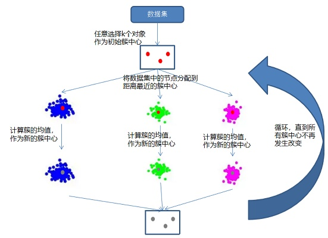
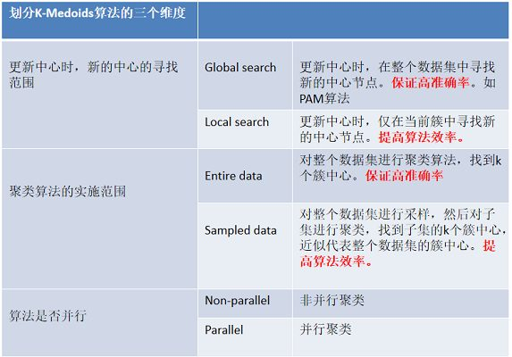
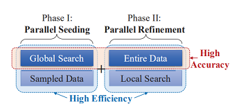
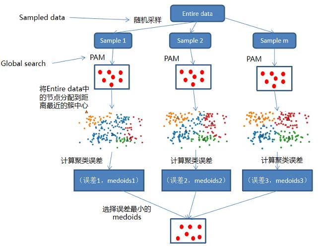
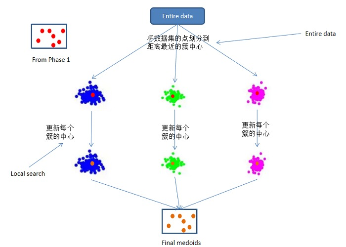
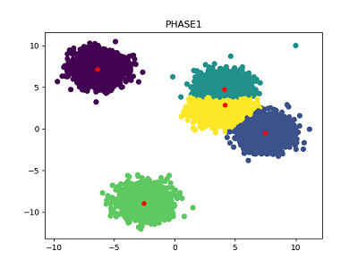
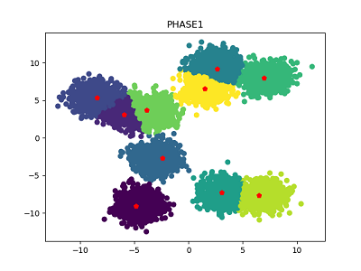
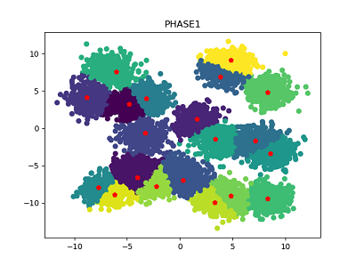

# PAMAE: Parallel k-Medoids Clustering with High Accuracy and Efficiency论文复现

## 项目介绍
[PAMAE: Parallel k-Medoids Clustering with High Accuracy and Efficiency](https://www.researchgate.net/publication/318918153_PAMAE_Parallel_k_-Medoids_Clustering_with_High_Accuracy_and_Efficiency)
是SIGKDD2017一篇关于k-medoids并行聚类的论文，论文中作者使用Spark与Hadoop实现算法的并行化，而本项目使用python并行编程模拟MapReduce的并行，对该论文算法的思想进行复现。

使用本项目复现的代码对中心数量分别为5、10、15、20的数据集进行聚类的效果图如下（数据集大小为1万）


## 使用方法
直接运行如下命令即可，程序会使用默认参数，生成一个数据集，并对该数据集执行聚类算法
```
python pamae.py
```
也可以指定如下参数：
- n_points：生成的数据的个数，默认为10000
- subset_size：phase 1中采样后子集的大小，默认为100
- subset_num：phase 1中采样的子集的数量 ，默认为5
- centroid_num：簇中心的数量 ，默认为10
```
python pamae.py --n_points 10000 --subset_size 100 --subset_num 5 --centroid_num 10
```

程序产生的Phase 1与Phase
2的聚类结果图，会保存在根目录的results文件夹下，命名方式为"phase[1|2]_数据集大小_采样子集大小_采样子集数量_中心数量"，并且在控制台输出每个阶段的的中心集合、耗时、聚类误差等数据


## 背景介绍
聚类就是将数据集划分为多个簇(cluster)，每个簇由若干相似对象组成，使得同一个簇中对象间的相似度最大化，不同簇中对象间的相似度最小化。其中k-means与k-medoids是最基础的两种聚类算法

k-means算法选择簇中所有对象的均值作为簇的中心，因此k-means算法实现简单、时间复杂度低，但其对噪声和离群点很敏感

k-medoids算法则是选择离簇均值最近的对象作为簇中心。所以k-medoids算法对噪声和离群点更具鲁棒性，但其时间复杂度却很高。

| | k-means |k-medoids|
|---------|--------|--------|
|优点|实现简单、时间复杂度低|对噪声和离群点更具鲁棒性|
|缺点|对噪声和离群点很敏感|时间复杂度高|

### k-means算法
算法简介：k-means算法采用簇中所有对象的均值作为簇中心。给定划分的簇的数量k。随机选择k个对象作为k个簇中心，将剩余对象指派到距离最近的簇，然后重新计算每个簇的新均值，得到更新后的簇中心。不断重复上述步骤，直到簇中心不再发生变化。

k-means算法伪代码如下： 
```
输入：数据集D，划分簇的个数k
输出：k个簇的集合
从数据集D中任意选择k个对象作为初始簇中心
repeat
    for 数据集D中每个对象P do
        计算对象P到k个簇中心的距离
        将对象P指派到与其最近(距离最短)的簇
    end for
    计算每个簇中对象的均值，以该均值点作为新的簇的中心
until k个簇的簇中心不再发生变化
```

k-means算法示意图如下： 



### PAM算法
算法简介：PAM算法是k-medoids算法的变种，PAM算法并不是采用簇的均值作为簇中心，而是选择簇中距平均值最近的对象作为簇中心

聚类误差S：所以对象到其簇中心的距离之和

PAM算法伪代码如下： 
```
输入：数据集D，划分簇的个数k
输出：k个簇的集合
从数据集D中任意选择k个对象作为初始簇中心
repeat
    把剩余对象分配到距离最近的簇中心
    对于所有(中心点C，非中心点P)的二元组。尝试将中心点与非中心点交换，并计算聚类误差
    若交换之后聚类误差降低了，则使用该非中心点替换中心点
until k个簇的簇中心不再发生变化
```

PAM算法示意图如下： 


## 研究现状
尽管k-medoids具有更好的鲁棒性，但是由于其计算复杂度过高，所以人们用的主要还是k-means算法。有许多研究者尝试解决k-medoids算法的效率问题，
但基本都是以算法准确率作为代价，也就是说现有研究都没能很好地解决k-medoids算法的效率与准确率之间的矛盾。

解决k-medoids算法效率问题的各种举措可以按照以下三个维度进行划分


 
通过上表，我们可以清楚看到 
- global search与entire data的使用可以提高算法的准确率，但会降低算法的效率
- sampled data与local search的使用可以提高算法效率，但会降低准确率

## 论文贡献
本文尝试在k-medoids的准确率与效率之间找到一个平衡点，于是作者提出了一个基于k-medoids的并行聚类算法(PAMAE)，算法分为两个阶段，每个阶段都使用Spark和Hadoop实现并行处理，提高算法的效率：
- 在第一阶段采用sampled data与global search策略
- 在第二阶段采用entire data与local search策略

进行以上组合的原因： global search与entire
data策略的使用可以提高算法的准确率，但同时使用，必定会降低算法的效率。而entire
data与local
search策略可以提高算法的效率，但同时使用，也必定会降低算法的准确率。因此作者在四者的组合中找到了一个平衡点，即sampled
data+global search与entire data+local search。

***第一阶段的sampled data可以提高算法效率，global
search可以提高算法准确率，这是一个高效率+高准确率的组合。***

***第二阶段的entire data可以提高算法准确率，local
search可以提高效率，也是一个高效率+高准确率的组合。***

***可以发现每个阶段都是高效率+高准确率的组合，PAMAE算法就是通过这种“一快一准”的策略组合，再加上MapReduce的并行处理，以达到高效率和高准确率之间的平衡***



## PAMAE算法描述
PAMAE算法分为如下两个阶段 
### Phase 1
算法思想：对整个数据集进行随机采样(sampled data
)，生成m个规模为n的子集。然后对m个子集并行执行PAM算法(global
search)，计算整个数据集的聚类误差，选择聚类误差最小的中心集合

算法流程： 
```
对整个数据集进行随机采样，生成m个规模为n的子集substes
for subset in subsets:
    使用global search策略(这里使用PAM算法)找到子集subset的k个簇中心
    将整个数据集Entire data的每个数据划分到距离最近的簇中心
    计算聚类误差(每个数据点到其簇中心的距离之和)
选择聚类误差最小的一组中心集合输入到Phase2    
```
***注：对于for循环里每个子集的聚类与计算聚类误差的操作，是并行的***

第一阶段的算法示意图如下： 


 
### Phase 2
经过Phase 1的步骤，已经得到了一个近似的聚类中心集合，但是Phase
1中的中心集合是从sampled
data中得到的，因此可能与真实的中心还存在一定的偏差，第二阶段就是为了对第一阶段生成的中心集合进行微调

算法思想：对于Phase
1获得的中心集合，将整个数据集的数据划分到距离最近的簇中心，然后并行更新每个簇的中心，以达到对簇中心进行微调的目的。得到的就是最终的k个簇中心

第二阶段的算法示意图如下： 



## 实验结果
数据集大小为1万，不同中心数量的数据集，第一阶段和第二阶段聚类结果如下所示。可以看到，经过Phase
1得到的聚类效果已经很不错，再经过Phase
2微调之后，聚类效果也确实有所提高。
 
簇中心数量为5：
 



簇中心数量为10：



 
簇中心数量为15：
 


簇中心数量为20：




## 不足
本项目使用python的并行编程模拟Spark与Hadoop的MapReduce并行计算，运算速度不如MapReduce。由于Phase
1采用的是Global
search的策略，运算复杂度较高，当采样子集规模较大时，Phase 
1的耗时会增大。


